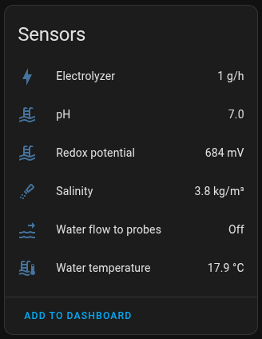
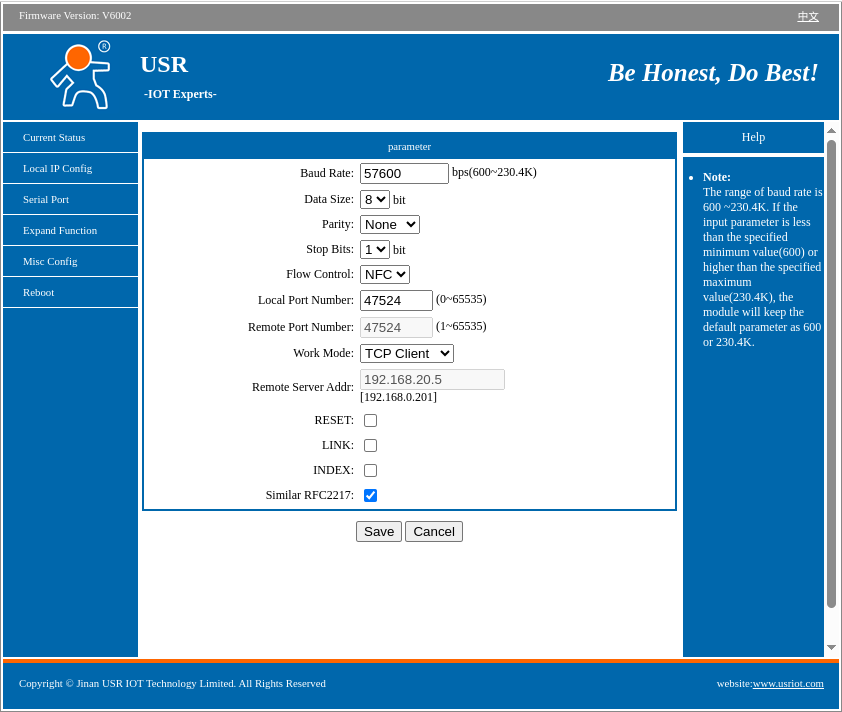

# Aseko Local

## Summary

Local integration for receiving data from Aseko pool units without relying on the Aseko Cloud.

The Aseko unit and your Home Assistant need to run on the same network as the integration relies on direct data stream from the unit.

## Installation

### Via HACS - recommended

Use this button to install the integration:

### Manual installation

There should be no need to use this method, but this is how:

- Download the zip / tar.gz source file from the release page.
- Extract the contents of the zip / tar.gz
- In the folder of the extracted content you will find a directory 'custom_components'.
- Copy this directory into your Home-Assistant '<config>' directory so that you end up with this directory structure: '<config>/custom_components/aseko_local
- Restart Home Assistant Core

## Configure your Aseko unit

You need to re-configure your Aseko unit to send data to your **Home Assistant** instance.

### If you don't want/need the data to be available in Aseko Cloud

1) Access your Aseko unit IP address
    - default credentials: **admin**/**admin**

2) Go to **Serial Port** configuration
     

3) Change **Remote Server Address** to the IP of your **Home Assistant** instance
4) Confirm the **Reboot** of the device

### Keep sending the data to Aseko Cloud as well

If you want to keep sending the data to Aseko Cloud, you will have to ensure mirroring of the data stream to both: Aseko Cloud & Home Assistant.