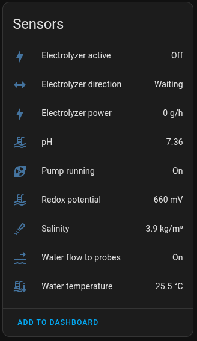
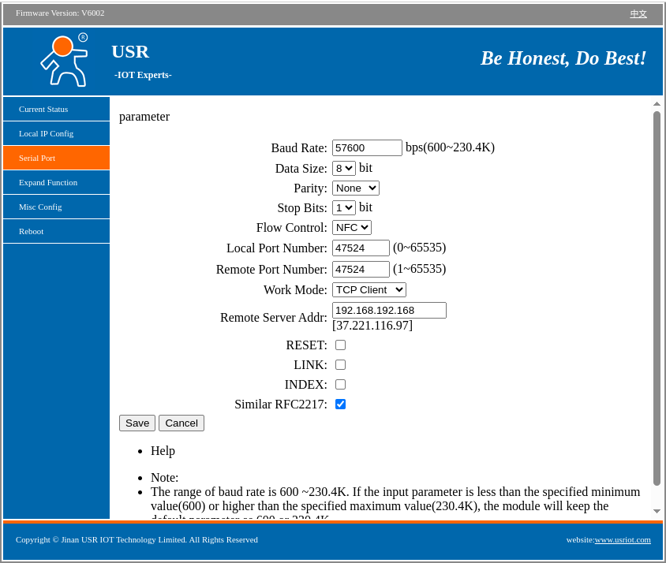
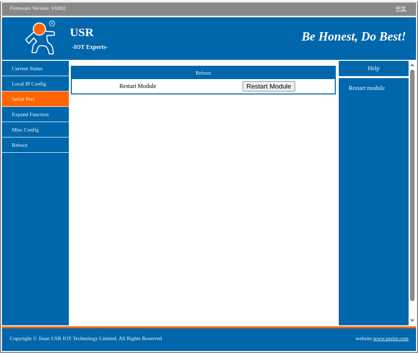
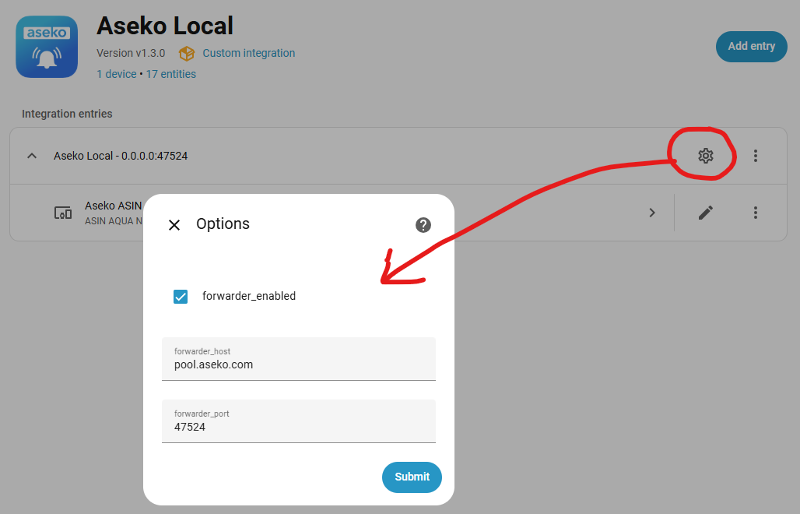

# Aseko Local

## Summary

Local integration for receiving data directly from **Aseko** pool unit without relying on the **[Aseko Cloud](https://aseko.cloud)**. The imported entities depends on your Aseko device model. Here is an example of ASIN Aqua SALT.

The Aseko unit and your Home Assistant need to run on the same network or traffic needs to be allowed to flow from the unit to the configured port (default is **47524**) as the integration relies on direct data stream from the unit.

**Aseko Local** gives you an option to forward reiceived raw data to Aseko Cloud (or anywhere else).

## Installation

### Via HACS - recommended

Use this button to install the integration:

### Manual installation

There should be no need to use this method, but this is how:

- Download the zip / tar.gz source file from the release page.
- Extract the contents of the zip / tar.gz
- In the folder of the extracted content you will find a directory 'custom_components'.
- Copy this directory into your Home-Assistant '<config>' directory so that you end up with this directory structure: '<config>/custom_components/aseko_local
- Restart Home Assistant Core

## Configure your Aseko unit

You need to re-configure your Aseko unit to send data to your Home Assistant instance.

### Aseko unit configuration

1. Access your Aseko unit IP address

   - default credentials: **admin**/**admin**

2. Go to **Serial Port** configuration

   
   You can see the default **Remote Srver Address** is **pool.aseko.com** (or something similar) and **Local/Remote Port Number** is **47524** - make note of that if you would like to keep sending the data there as well - see [Optional: Keep data to Aseko Cloud](#optional-keep-data-to-aseko-cloud)

   **WARNING:** In case you see in **Local/Remote Port Number** a different number than **47524** (e.g. **51050**) that meens you have a newer Firmware, which is using a different format of the messages sent to the Aseko, which is currently not supported.
   You might try to check with your vendor if the format can be changed on your unit.

3. Change **Remote Server Addr** to the IP address or DNS record of your **Home Assistant** instance on your local network (or your TCP mirror - see [Optional: Keep data to Aseko Cloud](#optional-keep-data-to-aseko-cloud))

   

4. (Optional) Change **Remote Port Number** to the port on which the integration will be listening on your **Home Assistant** instance (in case it can not be the default port **47524**)

5. Confirm the **Restart** of the module

   

### Optional: Keep data to Aseko Cloud

If you want to keep sending the data to Aseko Cloud, you had to use a TCP proxy (like [goduplicator](https://github.com/hopkins-tk/home-assistant-aseko-local/issues/14#issuecomment-2897932015)) before release `1.3.0`. The installation and configuration of goduplicator proved trouble some for some of the users and goduplicator has not been updated for over 5 years.

Since release `1.3.0` **Aseko Local** has a built in forwarder that can be enabled to forward the raw data received from Aseko Device to Aseko Cloud (default `pool.aseko.com:47524`). To use it, open **Aseko Local** integration, klick on settings (see image) and enable the forwarder.

## Device support

### Confirmed supported devices

| Device | Firmware | Sensors | Pump state | Chemical consumption |
|---|---|---|---|---|
| Aqua NET | ≤ 7.x | ✅ | ✅ cl, pH− | ✅ cl, pH− |
| Aqua SALT | ≤ 7.x | ✅ | ⚠️ pH− (bitmask unconfirmed) | ⚠️ pH− (bitmask unconfirmed) |

> **Firmware note:** This integration supports the **120-byte binary protocol** used by firmware ≤ 7.x. Aseko devices typically send to port **47524** by default; the port can be changed in the integration settings to match your device.
> Devices with newer firmware (e.g. those reporting port **51050**) transmit a different 463-byte record format that is not yet supported — see [issue #49](https://github.com/hopkins-tk/home-assistant-aseko-local/issues/49) for progress.

### Partially supported / untested devices

The following devices are likely compatible but the byte mapping for pump states and chemical consumption has not been confirmed:

| Device | Status | Known unknowns |
|---|---|---|
| Aqua HOME | ⚠️ Untested | Pump state bits uncertain; algicide/floc may share a single bit |
| Aqua PROFI (Aqua Pro) | ⚠️ Untested | Pump state bits uncertain; pH+ pump bit position unknown |

Sensors that cannot be mapped reliably are **not shown** by default to avoid misleading values.

### Help wanted — expanding device support

If you own an Aqua HOME, Aqua PROFI, or any other Aseko device that is not listed above as fully supported, you can help by sharing a diagnostics snapshot:

1. In Home Assistant go to **Settings → Devices & Services → Aseko Local**
2. Click on your device, then click **Download Diagnostics**
3. Open a new issue at [github.com/hopkins-tk/home-assistant-aseko-local](https://github.com/hopkins-tk/home-assistant-aseko-local/issues/new) and attach the downloaded JSON file

The diagnostics file contains an annotated table of every byte in the raw data frame sent by your device.
It does **not** contain any credentials or network addresses — those fields are automatically redacted.
