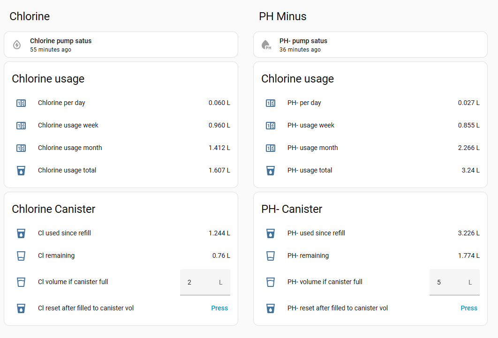
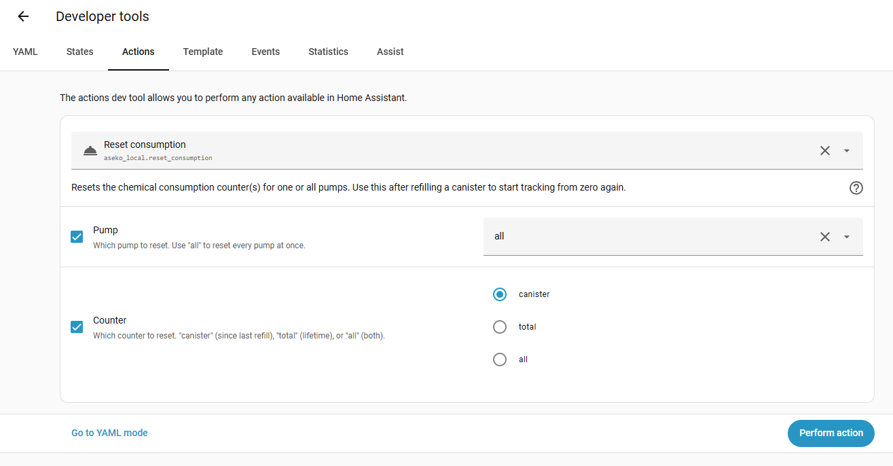
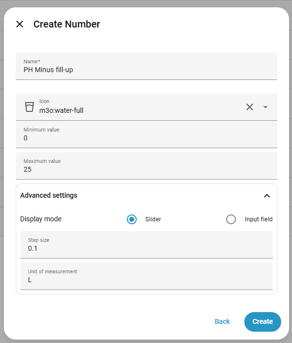
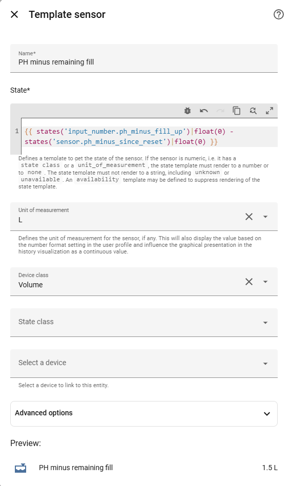

# Aseko Local

## Summary

Local integration for receiving data directly from **Aseko** pool unit without relying on the **[Aseko Cloud](https://aseko.cloud)**. The imported entities depends on your Aseko device model. Here is an example of ASIN Aqua SALT.

The Aseko unit and your Home Assistant need to run on the same network or traffic needs to be allowed to flow from the unit to the configured port (default is **47524**) as the integration relies on direct data stream from the unit.

**Aseko Local** gives you an option to forward reiceived raw data to Aseko Cloud (or anywhere else).

## Device support

### Confirmed supported devices

| Device | Firmware | Sensors | Pump state | Chemical consumption |
|---|---|---|---|---|
| ASIN Aqua Net | ≤ 7.x | ✅ | ✅ cl, PH− | ✅ cl, PH− |
| ASIN Aqua Net | 8.x | ✅ | ✅ Filtration, cl, PH− | ✅ cl, PH− |
| ASIN Aqua Salt | ≤ 7.x | ✅ | ✅ Filtration, Electrolyzer, Algicide, Flocculant, pH− | ✅ Algicide, Flocculant, pH− |
| ASIN Aqua Oxy | ≤ 7.x | ✅ | ✅ Filtration, Oxy, Algicide, Flocculant, pH− | ✅ Oxy,Algicide, Flocculant, pH− |
> **Firmware note:** This integration supports both the **120-byte binary protocol** (firmware ≤ 7.x, port **47524**) and the **text-frame protocol** (firmware 8.x, port **51050**). The port can be changed in the integration settings to match your device.

### Partially supported / untested devices

The following devices are likely compatible but the byte mapping for pump states and chemical consumption has not been confirmed:

| Device | Status | Known unknowns |
|---|---|---|
| ASIN Aqua Home | ⚠️ Untested | Pump state bits uncertain; algicide/floc may share a single bit |
| ASIN Salt | ⚠️ Untested | |
| ASIN Aqua Pro | ⚠️ Untested | Pump state bits uncertain; pH+ pump bit position unknown |
| ASIN Aqua Home Pro (07.2026) | ⚠️ Untested | Pump state bits uncertain; pH+ pump bit position unknown |
| ASIN Aqua Salt Pro (07.2026) | ⚠️ Untested | Pump state bits uncertain; pH+ pump bit position unknown |
| ASIN Aqua Home Pro Oxy (07.2026) | ⚠️ Untested | Pump state bits uncertain; pH+ pump bit position unknown |
| ASIN Aqua Eox Pro (07.2026) | ⚠️ Untested | Pump state bits uncertain; pH+ pump bit position unknown |
| ASIN Aqua Salt NET (01.2026) | ⚠️ Untested | Pump state bits uncertain; pH+ pump bit position unknown |
| ASIN Aqua Net+  | ⚠️ Untested | Pump state bits uncertain; pH+ pump bit position unknown |
| ASIN Aqua  | ❌ Unsupported | No network connection |

Sensors that cannot be mapped reliably are **not shown** by default to avoid misleading values.

### Help wanted — expanding device support

If you own an Aseko device that is not listed above as fully supported, you can help by sharing a diagnostics snapshot:

1. In Home Assistant go to **Settings → Devices & Services → Aseko Local**
2. Click on your device, then click **Download Diagnostics** (3-dots menu beside settings symbol)
3. Open a new issue at [github.com/hopkins-tk/home-assistant-aseko-local](https://github.com/hopkins-tk/home-assistant-aseko-local/issues/new) and attach the downloaded JSON file

The diagnostics file contains an annotated table of every byte in the raw data frame sent by your device.

## Installation

### Via HACS - recommended

Use this button to install the integration:

### Manual installation

There should be no need to use this method, but this is how:

- Download the zip / tar.gz source file from the release page.
- Extract the contents of the zip / tar.gz
- In the folder of the extracted content you will find a directory 'custom_components'.
- Copy this directory into your Home-Assistant '<config>' directory so that you end up with this directory structure: '<config>/custom_components/aseko_local
- Restart Home Assistant Core

## Configure your Aseko unit

You need to re-configure your Aseko unit to send data to your Home Assistant instance.

### Aseko unit configuration

1. Access your Aseko unit IP address

   - default credentials: **admin**/**admin**

2. Go to **Serial Port** configuration

   
   You can see the default **Remote Srver Address** is **pool.aseko.com** (or something similar) and **Local/Remote Port Number** is **47524** or **51050** - make note of that if you would like to keep sending the data there as well - see [Optional: Keep data to Aseko Cloud](#optional-keep-data-to-aseko-cloud)

   The port shown here tells you which firmware version your device is running:
   - **Port 47524** → firmware v7 or older (120-byte binary frame) — fully supported
   - **Port 51050** → firmware v8 (463-byte text frame) — supported
   But you could change it to whatever you want as long as it matches the port you set in the integration settings.

3. Change **Remote Server Addr** to the IP address or DNS record of your **Home Assistant** instance on your local network (or your TCP mirror - see [Optional: Keep data to Aseko Cloud](#optional-keep-data-to-aseko-cloud))

   

4. Set **Remote Port Number** to the port on which the integration will be listening on your **Home Assistant** instance.

   When adding the **Aseko Local** integration in Home Assistant, set the same port as in your device. The default **47524** works for firmware v7 devices. For firmware v8 devices the default is **51050**.

   > **Mixed setup (two devices, different firmware):** Both devices must send to the **same** port on Home Assistant — the integration uses a single server. Choose one port, set both devices to use it, and set the same port when configuring the integration.

5. Confirm the **Restart** of the module

   

### Optional: Send data to Aseko Cloud

If you want to keep sending the data to Aseko Cloud, you had to use a TCP proxy (like [goduplicator](https://github.com/hopkins-tk/home-assistant-aseko-local/issues/14#issuecomment-2897932015)) before release `1.3.0`. The installation and configuration of goduplicator proved trouble some for some of the users and goduplicator has not been updated for over 5 years.

**Aseko Local** has a built in forwarder that can be enabled to forward the raw data received from Aseko Device to Aseko Cloud. To use it, open **Aseko Local** integration, click on settings (see image) and enable the forwarder.

> The forwarder automatically selects the correct destination port based on the frame type received:
> - **Firmware v7 and older** (binary frame) → forwards to `pool.aseko.com` port **47524**
> - **Firmware v8** (text frame) → forwards to `pool.aseko.com` port **51050**
>
> No additional configuration is needed.

## Chemical consumption & canister management

Supported devices report how much chemical each dosing pump has dispensed. The integration exposes two consumption sensors per pump:

- **Since last reset** (`*_since_reset`) — resets to zero when you refill the canister and trigger a reset.
- **Total** (`*_total`) — a running lifetime total that never resets automatically.
- **Reset Button** — a dashboard button to reset the *since last reset* counter after refilling a canister.
- **Pump state** — the integration also decodes pump states (on/off) from the raw data, so you can track when pumps are running in real time and you can analyze the history like how often and how long running.
- **Other information** like canister fill-up volume and remaining volume can be tracked using standard Home Assistant helpers and templates — see below for details.

Here is an example of the consumption sensors and canister settings in Home Assistant:

### Resetting the canister counter

After refilling a chemical canister trigger a reset so the *since last reset* counter starts from zero again.

**Option 1 – Dashboard button**

Add a **button card** or an **entity card** and choose the button entity ***_refill_reset** (see image above).

**Option 2 – Developer Tools**

Go to **Developer Tools → Actions**, search for `aseko_local.reset_consumption` and call it with the pump you refilled (or `all`) and counter `canister`. With this method you can also reset the *total* counter, which is not possible with the dashboard button.

### Optional: Track remaining canister volume

Aseko's own app counts down the remaining chemical volume in a canister. You can replicate this in Home Assistant using two standard helpers.

**Step 1 – Number helper for fill-up amount**

Go to **Settings → Devices & Services → Helpers → Create helper → Number** and create one helper per chemical, e.g.:

| Field | Example value |
|---|---|
| Name | PH Minus fill-up |
| Minimum | 0 |
| Maximum | 25 |
| Step | 0.1 |
| Unit of measurement | L |

When you refill the canister, update this helper to the volume you actually added before triggering the reset.

**Step 2 – Template sensor for remaining volume**

Go to **Settings → Devices & Services → Helpers → Create helper → Template → Template sensor** and configure it as follows:

| Field | Example value |
|---|---|
| Name | PH minus remaining fill |
| State template | `{{ states('input_number.ph_minus_fill_up')\|float(0) - states('sensor.ph_minus_since_reset')\|float(0) }}` |
| Unit of measurement | L |
| Device class | Volume |

Adjust the entity IDs to match your own helper and sensor names.

**Step 3 - Issue utility meter for periodic usage like daily/weekly/monthly consumption**
Go to **Settings → Devices & Services → Helpers → Create helper → Utility Meter** and configure it as follows:
- Name: PH minus daily usage
- Meter type: Daily
- Source entity: sensor.ph_minus_total (or sensor.ph_minus_since_reset, depending on your preference)
- reset on: midnight (for daily), or the first day of the month (for monthly), etc.
- Device class: Energy (or None, depending on your preference)
- Unit of measurement: L

**Step 4 – Add everything to a dashboard card**

Combine the fill-up number input, the *since last reset* sensor, the remaining volume template sensor, and a reset button into a single dashboard card for a complete canister management view.

